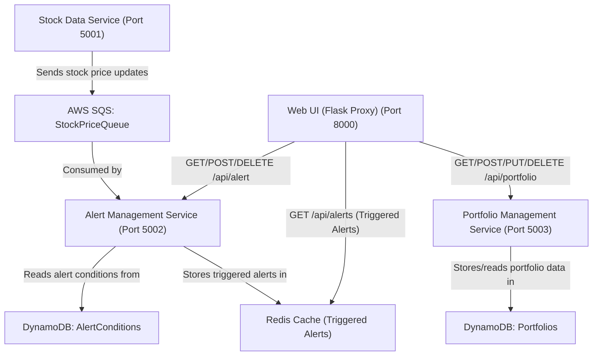

# Stock Price Alert Notification System

## Overview
The Stock Price Alert Notification is a cloud-based application designed to monitor (near) real-time stock prices and notify users when their predefined alert conditions are met. This system enables timely investment decisions by leveraging traditional integration mechanisms:
- **Messaging & Queuing:** AWS SQS for transferring stock price updates.
- **NoSQL Database:** AWS DynamoDB for storing alert conditions and portfolio data.
- **Caching:** Redis for caching triggered alerts for quick access.

This project is a homework demonstration of microservices architecture and comprises three main microservices plus a Web UI, all deployed on the cloud.

> **DISCLAIMER:** This dashboard is provided solely for homework demonstration purposes. The primary focus of this project is to showcase the distributed microservices architecture and the integration mechanisms (messaging, queuing, caching, and NoSQL databases) used to implement the system. Consequently, the user interface is intentionally kept minimal and is not refined for advaced use—fields such as User ID and Alert ID are manually entered, and the dashboard is accessible to all users.

## Architecture & Data Flow

Below is the system architecture diagram detailing the components and API endpoints:


> Can't view? Paste the diagram code into the [Mermaid Live Editor](https://mermaid-js.github.io/mermaid-live-editor/) to visualize it.

The architecture of the Stock Price Alert Notification System is designed to showcase a distributed microservices approach with clear separation of concerns, leveraging AWS cloud services and traditional integration mechanisms. In this system, the Stock Data Service (running on port 5001) periodically fetches real‑time stock prices using external APIs (e.g., Yahoo Finance) and sends updates to an AWS SQS queue named StockPriceQueue. The Alert Management Service (port 5002) consumes messages from the StockPriceQueue, reads user-defined alert conditions stored in a DynamoDB table (AlertConditions), and if any conditions are met, caches the triggered alerts in a Redis instance. Meanwhile, the Portfolio Management Service (port 5003) manages user portfolios using another DynamoDB table (Portfolios). Finally, the Web UI, served through a Flask proxy (port 8000), integrates all these components by providing API endpoints that allow users to manage portfolios, alert conditions, and view triggered alerts—all while avoiding CORS issues.

For example, suppose a user has added a portfolio entry for “AAPL” and set an alert condition to trigger if the stock price exceeds $150. The Stock Data Service will fetch the current price of AAPL and send a message (e.g., “AAPL:152.35”) to the SQS queue. The Alert Management Service, upon receiving this message, checks the alert conditions stored in DynamoDB. Detecting that the condition for AAPL is met, it caches the alert in Redis. The Web UI then retrieves this triggered alert via its proxy endpoint (GET /api/alerts) and displays it to the user, along with options to dismiss the alert. This end-to-end flow demonstrates the use of messaging (SQS), a NoSQL database (DynamoDB), and caching (Redis) to build a cloud-based distributed application that meets the project rubric requirements.

## API Endpoints

### Stock Data Service (Port 5001)
- **`GET /`**  
    - _Description:_ Returns a status message ("Stock Data Service Running").  
    - _Function:_ Periodically fetches stock prices (using yfinance) for tickers found in the portfolio and sends messages (formatted as "TICKER:price") to the AWS SQS queue.

### Alert Management Service (Port 5002)
- **`GET /alerts`**  
    - _Description:_ Retrieves all triggered alerts from Redis.
  
- **`GET /alert`**  
    - _Description:_ Lists all defined alert conditions stored in DynamoDB.
  
- **`POST /alert`**  
    - _Description:_ Creates a new alert condition.  
    - _Input:_ JSON with `alert_id`, `stock_symbol`, `condition_type` (either `above` or `below`), and `threshold`.

- **`DELETE /alert?alert_id=...`**  
    - _Description:_ Deletes the alert condition with the specified `alert_id`.

### Portfolio Management Service (Port 5003)
- **`GET /portfolio`**  
    - _Description:_ Retrieves all portfolio entries (optionally filtered by User ID).
  
- **`POST /portfolio`**  
    - _Description:_ Adds a new portfolio entry.
  
- **`PUT /portfolio/<portfolio_id>`**  
    - _Description:_ Updates an existing portfolio entry identified by `portfolio_id`.
  
- **`DELETE /portfolio/<portfolio_id>`**  
    - _Description:_ Deletes the portfolio entry identified by `portfolio_id`.

### Web UI (Flask Proxy) (Port 8000)
This lightweight Flask application serves the dashboard and provides proxy endpoints (to avoid CORS issues):
- **`GET /api/portfolio`** (and POST/PUT/DELETE)  
    - _Proxies requests to the Portfolio Management Service._
- **`GET /api/alerts`**  
    - _Proxies requests to the Alert Management Service to fetch triggered alerts._
- **`GET/POST/DELETE /api/alert`t**  
    - _Proxies requests to the Alert Management Service for managing alert conditions._
- **`GET /`**  
    - _Serves the dashboard interface with a dark, Scandinavian/Japanese minimalistic design._

## Setup & Running Instructions

1. **Install Dependencies:**  
   In each service directory (StockDataService, AlertManagementService, PortfolioManagementService, and the Web UI Flask app), run:
```bash
pip install -r requirements.txt
```

2. **AWS Resource Setup:**  
   Provision the required cloud resources using the AWS CLI (ensure your AWS CLI is configured) and paste relevant details in config.py:

```bash
aws sqs create-queue --queue-name StockPriceQueue --region us-east-1

aws dynamodb create-table --table-name AlertConditions --attribute-definitions AttributeName=alert_id,AttributeType=S --key-schema AttributeName=alert_id,KeyType=HASH --provisioned-throughput ReadCapacityUnits=5,WriteCapacityUnits=5 --region us-east-1

aws dynamodb create-table --table-name Portfolios --attribute-definitions AttributeName=portfolio_id,AttributeType=S --key-schema AttributeName=portfolio_id,KeyType=HASH --provisioned-throughput ReadCapacityUnits=5,WriteCapacityUnits=5 --region us-east-1

aws elasticache create-cache-cluster --cache-cluster-id my-redis-cluster --engine redis --cache-node-type cache.t2.micro --num-cache-nodes 1 --region us-east-1
```

```python
# config.py
AWS_REGION = "us-east-1"
SQS_QUEUE_URL = "https://sqs.us-east-1.amazonaws.com/YOUR_ACCOUNT_ID/StockPriceQueue"
ALERT_TABLE_NAME = "AlertConditions"
PORTFOLIO_TABLE_NAME = "Portfolios"
REDIS_HOST = "localhost"
REDIS_PORT = 6379
REDIS_DB = 0
```

3. **Start the Microservices:**  

- **Stock Data Service (Port 5001):**  
     
```bash
python app.py
```

- **Alert Management Service (Port 5002):**  
     
```bash
python app.py
```
   *Note:* Ensure Redis is running on localhost:6379 or update its configuration accordingly.
     
- **Portfolio Management Service (Port 5003):**  
     
```bash
python app.py
```

4. **Start the Web UI:**  
   Navigate to the Web UI Flask app directory and run:

```bash
python app.py
```

   The dashboard will be available at [http://localhost:8000](http://localhost:8000).
